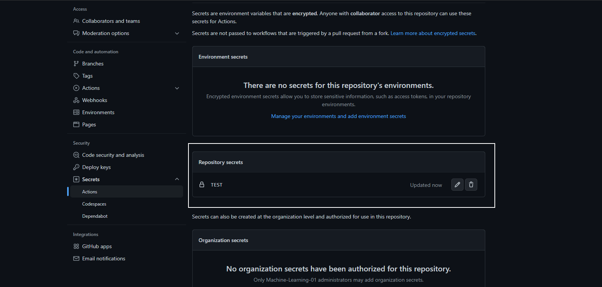

# Automated Deployment for Sensor Fault Detection Project

## AWS CLI Installation

### Install AWS CLI in Linux System

To install awscli in linux system, execute the following commands

```bash
sudo apt update
```

```bash
sudo apt upgrade
```

```bash
sudo apt install awscli
```

### Install AWS CLI in Windows System

To install awscli in windows system, follow the process, 

Install the msi package of awscli

```bash
https://awscli.amazonaws.com/AWSCLIV2.msi
```

Once the download and double click on the installer, and click on next and agree to the terms and conditions, and click on next and click on install button. Once the installation is done, click on finish and proceed to the futher steps

### Install AWS CLI in MacOS System

To install awscli on MacOS system, execute the following commands

```bash
curl "https://awscli.amazonaws.com/AWSCLIV2.pkg" -o "AWSCLIV2.pkg"
```

```bash
sudo installer -pkg AWSCLIV2.pkg -target /
```

### Check AWS CLI installation

To check aws cli is working fine or not, execute the following commands

```bash
aws --version
```

## Login to AWS Console

First step is to login to the console, you can open aws console in your browser and login with your credentials


## Creating IAM role for getting access to AWS resources

Once you are logged into you aws account, you need to create IAM user for getting credentials


On click on IAM, and you will redirected to IAM console, from there click on add users 


You need to add user details like user name with programmatic access. Once that is done, click on next permissions


With that done, we need attach policies to the user to grant accesss to AWS resources. Some of the policies are S3 access, EC2 access and ECR access


Once the policies are attached, review the user name and policies attached to the user


Once the user name and policies are reviewed, click on download csv, and there are csv file which contains your AWS credentials. Kindly keep this in secret and do not share with anyone


## Configuring AWS credentials to use AWS resources

Once the installation of AWS cli is done, in the respective OS, and verfied that installation is successfull. Locate the aws credentials file which you have downloaded while creating the user from the console. Open the credentials csv file and parallely open terminal, execute the following commands

```bash
aws configure
```

On executing the following commands, you will be prompted to give AWS Access Key ID, in csv file opened, use the value of Access Key ID. Once the value is entered, press enter and you will be prompted for AWS Secret Access Key, use the value of Secret access key and press enter and you will be prompted for default region name, give the value as "us-east-1" and press enter and you will be prompted for Default output format, use the value as json. Once this process is done, you have successfully configured AWS credentials in your local system and you are ready to use AWS resources from your terminal

## Terraform Setup

Terraform by design stores the terraform state and other configuration files in local by default if not specified. Since the terraform state and other configuration files are secrets, and most not be shared with others, terraform provides a remote backend apart from local to store these files. Some of the remote backend are

### Install Terraform in Linux System

```bash
sudo apt-get update && sudo apt-get install -y gnupg software-properties-common curl
```

```bash
curl -fsSL https://apt.releases.hashicorp.com/gpg | sudo apt-key add -
```

```bash
sudo apt-add-repository "deb [arch=amd64] https://apt.releases.hashicorp.com $(lsb_release -cs) main"
```

```bash
sudo apt-get update && sudo apt-get install terraform
```

### Install Terraform in MacOS System

```bash
brew tap hashicorp/tap
```

```bash
brew install hashicorp/tap/terraform
```

### Install Terraform in Windows System

To install terraform in windows, first we have to install choco package manager, first open the powershell or command prompt with administrator access and then execute the following commands

```bash
Set-ExecutionPolicy Bypass -Scope Process -Force; [System.Net.ServicePointManager]::SecurityProtocol = [System.Net.ServicePointManager]::SecurityProtocol -bor 3072; iex ((New-Object System.Net.WebClient).DownloadString('https://community.chocolatey.org/install.ps1'))
```

To check choco installation is working or not, execute the following 

```bash
choco --version
```

Once the choco installation is working fine, we can go forward with the installation of terraform

```bash
choco install terraform
```

### Check for terraform installation

To check whether the terraform installation is working fine or not. Execute the following commands

```bash
terraform --version
```

## Setup Github secrets to deploy via Github Actions
In order to store and use secrets in github workflows, follow the steps in the screenshots. 

In your repository, go to settings and then under security, click on secrets and then actions 


Once that is done, we can put secrets by clicking on new repository secret button


Put use secret name and secret values corresponding to the one in github workflow

Note - This step is applicable for all secrets, and once the secrets are kept there is no way to see what is the value of the secret

AWS_ACCESS_KEY_ID ["AWS_ACCESS_KEY_ID"]

AWS_SECRET_ACCESS_KEY ["AWS_SECRET_ACCESS_KEY"]

AWS_DEFAULT_REGION ["AWS_DEFAULT_REGION"]

MONGO_DB_URL - ["MONGO_DB_URL]

ECR_REPO - ["name of ecr repo created"]


To check whether the secret has been created or not




## Terraform code changes for provisioning infrastructure

Since we are using terraform to setup the infrastructure, we have to create a backend, where terraform can store the state of the infrastructure and other files, We can use AWS S3 buckets, Azure Blob Storage or GCS buckets. 

First go to the S3 console, click on create bucket, give the bucket name as "{unique_name}-sensor-tf-state", we are using because the s3 bucket name should be globally unique, else bucket will not be created and raise an error. Scroll down to bucket versioning and enable it, and then click on create bucket. On successfull execution, the bucket will be created with the bucket name.

Now that the bucket is created, go to infrastructure folder and open the module.tf file and make the following changes.

```bash
terraform {
  backend "s3" {
    bucket = "YOUR_BUCKET_NAME"
    key    = "tf_state"
    region = "us-east-1"
  }
}
```

Once it is done, you have successfully created your backend, in the terraform code. Now that the backend is created, we need to initialize the terraform, so that the neccessary modules are initialized. Before we initialize the terraform, open vscode in the infrastructure folder, execute the following commands. Make sure that you aws credentials are properly configured. Once that is done

```bash
terraform init
```

This command will make sure that all the neccessary modules are initialized before creating the infrastructure. Since we are using ec2 instance as a part of our infrastructure, we need to create the key pair, to connect to the ec2 instance. To create the ec2 key pair, go to the EC2 console dashboard, in there scroll down to network and security tab, click on key pairs, and then click on create key pair, give the name as {your_name} and select the private key file format as .pem and click on create key pair. A download pop up will come up, select the location where to download the key pair.  Once that is done, go to infrastructure/sensor_ec2/variables.tf file and then change the name to {YOUR_KEY_PAIR_NAME}. 

```bash
variable "app_key_pair_name" {
  type    = string
  default = "{YOUR_KEY_PAIR_NAME}"
}
```

Now that everything is set, we can plan and create our infrastructure using terraform. To plan the infrastructure, execute the following commands

```bash
terraform plan
```

On successfully execution of the commands, we can create/apply the infrastructure if we are satisfied with the plan

```bash
terraform apply --auto-approve
```

On successfull execution of the commands, all the terraform modules present in infrastructure will be created by terraform. If at any point, we want to create specific modules of the infrastructure, execute the commands

```bash
terraform apply -target=module.<module_name> --auto-approve
```

To destroy the infrastructure, execute the following commands

```bash
terraform destroy --auto-approve
```

If at any point of want to destroy, only a part of the infrastructure, then execute the following commands, 

```bash
terraform destroy -target=module.<module_name> --auto-approve
```